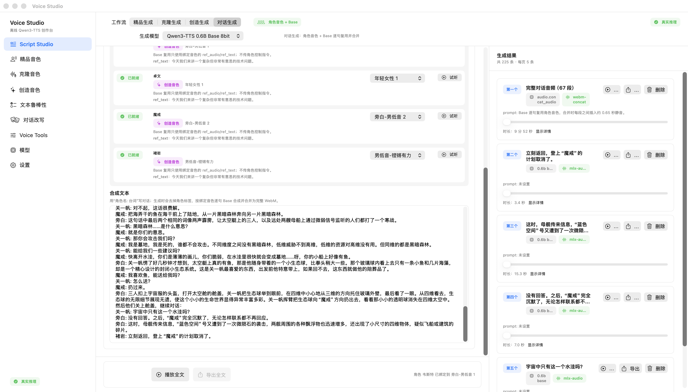
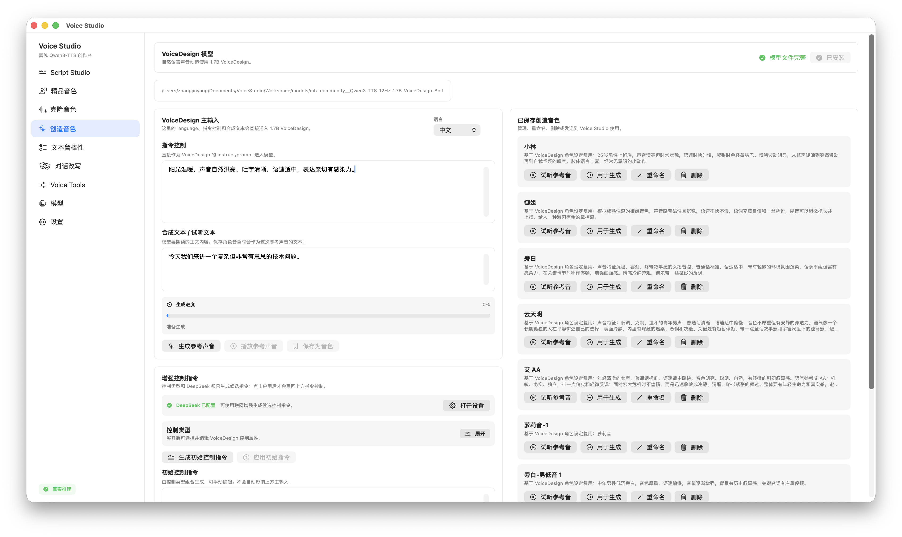
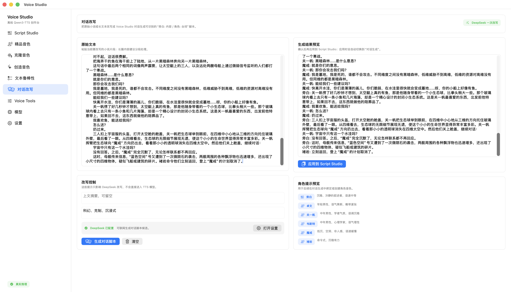

# Voice Studio

Voice Studio 是面向 Apple Silicon Mac 的本地语音创作工具，提供精品音色生成、音色克隆、创造音色、对话生成和对话改写等能力。项目重点服务小说、短剧、旁白、角色对白和多角色音频创作，让用户可以在一个桌面 App 内完成从文本改写、角色配音到完整音频导出的流程。

当前发布版本：`0.01`。

## 核心功能

- 精品音色生成：选择内置音色，输入文本后快速生成旁白、讲解、口播或角色语音。
- 音色克隆：导入或录制参考音频，保存为本地可复用音色。
- 创造音色：用自然语言描述一个角色声音，生成参考音色并保存到音色库。
- 对话生成：为旁白和多个角色绑定不同音色，逐句生成并合并成完整对话音频。
- 对话改写：把小说或长文本改写成“旁白 + 角色台词”的结构，便于直接进入对话生成。
- 多角色音色组合：同一个项目里可以组合多个已保存音色，为不同角色绑定不同声线。
- 播放与导出：支持播放、暂停、拖动进度、生成历史、单段导出和全文导出。
- Voice Tools：支持导入常见音频格式，并合并为统一的 WebM 音频。

## 对话音频示例

0.01 发布版附带一段多角色对话生成示例，展示从角色音色绑定、逐句生成到完整音频合并的效果。

<table>
  <thead>
    <tr>
      <th>合成文本</th>
      <th>合成样例</th>
    </tr>
  </thead>
  <tbody>
    <tr>
      <td width="72%">
        <details>
          <summary>展开查看完整合成文本</summary>
          <pre>旁白: 航行又持续了两个多小时，如果在三维，太空艇已经航行了二十万千米左右。突然间，硬币大小的“魔戒”顶天立地地出现在前方。
卓文: 紧急转向！
旁白: 卓文用目光操纵太空艇紧急转向，使撞向环箍的太空艇从“魔戒”的圆环中穿过。从艇中看去，像是通过了太空中一道巨大的拱门。太空艇全力减速，然后返回，悬停在距“魔戒”的圆心不远处。
旁白: 这是人类第一次近距离看到四维物体，与高维空间感相似，他们感受到了被称为高维质感的宏伟。“魔戒”是全封闭的，看不到内部，但能感觉到一种巨大的纵深感和包容性。在来自三维世界的眼光中，所看到的“魔戒”不是一个“魔戒”，而是无数个“魔戒”的叠加，这种四维质感摄人心魄，是真正的纳须弥于芥子的境界。
旁白: 从这个距离看到的“魔戒”表面，与从飞船上用望远镜观察有很大不同。它的色彩由金黄变成了暗铜色，那些电路般的精细线条其实是碰撞的擦痕，仍然没有任何活动迹象，也没有光亮和其他辐射。看着“魔戒”陈旧的表面，太空艇上的三个人都感到似曾相识，他们想起了被摧毁的水滴，进而想象：如果这个巨大的四维圆环也曾有过晶亮的镜面表面，那又是何等惊人的景象。
旁白: 按照计划，卓文用中频电波发送了一个问候语。这是一幅简单的点阵图，图中由六行不同数量的点组成了一个质数数列：1、3、5、7、11、13。
旁白: 他们没有指望得到应答，但应答立刻出现了，速度之快让三人不敢相信自己的眼睛。悬浮在太空艇舱里的信息窗口显示出一个简单点阵图，与他们发送的类似，也用六行点组成六个质数，但图中的点阵大了许多，把他们发送的那个数列接了下来：17、19、23、29、31、37。
卓文: 对方回答了我们的问候。
旁白: 在探险计划中，发送问候语只是一个随意的尝试，并没有准备在得到应答后如何进一步交流。正当三人不知所措时，太空艇的通信系统收到了“魔戒”发来的第二幅点阵图，是这样一个数列，1、3、5、7、11、13、1、4、2、1、5、9。很快又收到了第三幅点阵图：1、3、5、7、11、13、16、6、10、10、4、7。然后是第四幅点阵图：1、3、5、7、11、13、19、5、1、15、4、8。第五幅点阵图：1、3、5、7、11、13、7、2、16、4、1、14。点阵图形不断地发来，这些图形所表示的数列都有一个明显的共同点：头六个质数是他们发送的问候语。至于后面那六个数，卓文和韦斯特都把期待的目光投向身为科学家的关一帆。
关一帆: 我看不出后六个数的规律。
韦斯特: 那就假设没有规律。前六个数是我们发送的，最可能的含义就是表示我们，后六个数没有规律且不断出现不同的组合，可能代表“一切”，我们的一切。
关一帆: “它”想知道我们的有关资料？
韦斯特: 更有可能是语言样本，以便“它”译解和学习后再与我们进一步交流。
关一帆: 那就把罗塞塔系统发给“它”吧。
卓文: 这需要请示。
旁白: 罗塞塔系统是一个为了三体世界的地球语言教学而研制的数据库，数据库中包含了约两百万字的地球自然史和人类历史的文字资料，还有大量的动态图像和图画，同时配有一个软件将文字与图像中的相应元素对应起来，以便于对地球语言的译解和学习。
旁白: 母船批准了探险队的请求，但太空艇上没有罗塞塔系统，而此时太空艇与母船的通信信号已经很微弱了，不可能进行大容量的信息传递，只能由母船直接向“魔戒”发送。用电磁波当然也不可能，好在“万有引力”号上装备了中微子通信设备，但不知道“魔戒”能否接收中微子信号。
旁白: 在“万有引力”号用中微子信号发送罗塞塔系统后的三分钟，太空艇收到了来自“魔戒”的一系列点阵图，第一幅是很整齐的一个8x8点阵，共六十四个点；第二幅图中点阵的一角少了一个点，剩下六十三个；第三幅图中又少一点，剩六十二……
韦斯特: 这是倒计数，也相当于一个进度条，可能表示“它”已经收到了罗塞塔，正在译解，让我们等待。
关一帆: 可为什么是六十四点呢？
韦斯特: 使用二进制时一个不大不小的数呗，与十进制的一百差不多。
旁白: 卓文和关一帆都很庆幸能带韦斯特来，在与未知的智慧体建立交流方面，心理学家确实很有才能。
旁白: 在倒计数达到五十七时，令人激动的事情出现了：下一个计数没有用点阵表示，“魔戒”发来的图片上赫然显示出人类的阿拉伯数字56！
关一帆: 学得真快！
旁白: 数字继续减小，每隔约十几秒减1，几分钟后，数字减到0。最新发来的图片上显示出四个汉字：
魔戒: 我是墓地。
旁白: 罗塞塔系统中使用的是汉英混合的文字，“魔戒”肯定也是使用这种文字，只是这句话正好都是汉字。关一帆向通信窗口中输入一个问题，开始了人类与“魔戒”
关一帆: 谁的墓地？
魔戒: 这个墓地的建造者的墓地。
关一帆: 这是一艘宇宙飞船吗？
魔戒: 曾经是飞船，死了以后就是墓地。
关一帆: 你是谁？和我们说话的是谁？
魔戒: 我是墓地，墓地在和你们说话，我是死的。
关一帆: 你是说你是乘员已经死去的飞船本身，或者说是飞船的控制系统？
旁白: 没有回答。
关一帆: 附近区域还有许多物体，它们也都是墓地吗？
魔戒: 大部分是墓地，不久后都要成为墓地，我不认识它们。
关一帆: 你们是从远处来的，还是一直在这里？
魔戒: 我从远处来，它们也从远处来，从不同的远处来。
关一帆: 从哪里来？
魔戒: 海。
关一帆: 这片四维空间是你们建造的吗？
旁白: 没有回答。
关一帆: 你们说自己从海里来，海是你们建造的吗？
魔戒: 是水洼，海干了。
关一帆: 为什么这么小的空间里聚集了这么多的飞船，或者说墓地？
魔戒: 海干了鱼就要聚集在水洼里，水洼也在干涸，鱼都将消失。
关一帆: 所有的鱼都在这里吗？
魔戒: 把海弄干的鱼不在。
关一帆: 对不起，这话很费解。
魔戒: 把海弄干的鱼在海干前上了陆地，从一片黑暗森林奔向另一片黑暗森林。
旁白: 这句话中最后两个相同的词像两声霹雳，让太空艇上的三人，以及远处两艘母船上通过微弱信号监听的人们都打了一个寒战。
关一帆: 黑暗森林……是什么意思？
魔戒: 就是你们的意思。
关一帆: 那你会攻击我们吗？
魔戒: 我是墓地，我是死的，谁都不会攻击。不同维度之间没有黑暗森林，低维威胁不到高维，低维的资源对高维没有用。但同维的都是黑暗森林。
关一帆: 能给我们一些建议吗？
魔戒: 快离开水洼，你们是薄薄的画儿，你们脆弱，在水洼里很快就会变成墓地……呀，你的小船上好像有鱼。
旁白: 关一帆愣了好几秒钟才想到，太空艇上真的有鱼，那是他随身带着的一个小生态球，比拳头稍大一些。那个玻璃球内看上去只有一条小鱼和几片海藻，却是一个精心设计的封闭小生态系统。这是关一帆最喜爱的东西，出发前他特意带上，如果回不去，这东西就做他的陪葬品了。
魔戒: 我喜欢鱼，能送给我吗？
关一帆: 怎么送？
魔戒: 扔过来。
旁白: 三人扣上宇宙服的头盔，打开太空舱的舱盖，关一帆把生态球举到眼前，在四维中小心地从三维的方向托住玻璃外壁，最后看了一眼。从四维看去，生态球的无限细节展现无遗，使这个小小的生命世界显得异常丰富多彩。关一帆挥臂把生态球向“魔戒”方向扔出去，看着那小小的透明球消失在四维太空中。然后他们关上舱盖，继续对话：
关一帆: 宇宙中只有这一个水洼吗？
旁白: 没有回答。之后，“魔戒”完全沉默了，无论怎样联系都不再回应。
旁白: 这时，母舰传来信息，“蓝色空间”号又遭到了一次微陨石的袭击，两舰周围的各种飘浮物也迅速增多，还出现了小尺寸的四维物体，疑似飞船或建筑的碎片。
褚岩: 立刻返回，登上“魔戒”的计划取消了。</pre>
        </details>
      </td>
      <td width="28%">
        <audio controls preload="metadata" src="https://github.com/cosmicrealm/VoiceStudio/releases/download/v0.01/Voice-Studio-0.01-dialogue-demo.webm"></audio>
      </td>
    </tr>
  </tbody>
</table>

## 界面预览

### Script Studio 对话生成



### VoiceDesign 创造音色



### DeepSeek 对话改写



## 安装与运行

### 下载发布版

从 Release 页面下载：

```text
Voice-Studio-0.01-macOS-arm64.zip
```

解压后打开 `Voice Studio.app`。首次打开如果 macOS 提示未验证开发者，请在系统安全设置中允许打开。

### 从源码运行

```bash
swift run MacQwenVoice
```

### 打包本地 App

```bash
scripts/build_app_bundle.sh
open "dist/Voice Studio.app"
```

### 生成发布包

```bash
scripts/package_release.sh
```

发布包会生成到 `dist/` 目录。

## 首次使用

1. 打开 `Voice Studio.app`。
2. 进入 `模型` 页面，下载需要的语音模型。
3. 回到 `Script Studio`，选择精品生成、克隆生成、创造生成或对话生成。
4. 输入文本、选择音色并生成音频。

默认工作区位于：

```text
~/Documents/VoiceStudio/Workspace/
```

模型、项目、参考音频、生成音频、数据库和配置都会保存在本机工作区内。

## 工作流

### 精品生成

适合快速生成旁白、口播、讲解和单角色语音。选择内置音色后输入文本即可生成，也可以使用控制指令调整声音表现。

### 克隆生成

适合复用已有声音。用户导入或录制参考音频，填写对应文本和授权用途后保存为本地音色；后续可以在克隆生成和对话生成中复用。

### 创造音色

适合创建新角色声音。用户用自然语言描述年龄、气质、语速、情绪、叙事风格等特征，生成满意后保存为角色音色。

### 对话生成

适合短剧、小说片段和多角色对白。用户可以为旁白、主角、配角分别绑定音色，系统会按角色逐句生成，并合并为完整音频。

这是 0.01 的重点能力：先为角色创造音色，再把这些音色作为可复用参考，用于多角色对话生成。

### 对话改写

对话改写可以把长文本整理为 Voice Studio 更容易识别的脚本格式：

```text
旁白: ...
角色A: ...
角色B: ...
```

改写会尽量保留原意和信息点，让旁白负责环境、动作和信息承接，让角色台词负责冲突推进和情绪表达。DeepSeek API key 可在 `设置` 页面配置。

### Voice Tools

Voice Tools 用于音频整理和合并。支持 `wav`、`mp3`、`m4a`、`aac`、`flac`、`ogg`、`opus`、`aiff`、`aif`、`caf`、`webm` 等常见格式，扩展名大小写不敏感。

## 系统要求

- Apple Silicon Mac。
- macOS 14 或更新版本。
- Python 3.10+。
- `ffmpeg`。
- `hf` CLI。
- 本地语音运行依赖，包括 `mlx`、`mlx_audio`、`transformers`、`numpy`。

如需指定 Python 环境，可以在启动前设置：

```bash
export MACQWENVOICE_PYTHON="/path/to/python3"
open "dist/Voice Studio.app"
```

## 隐私与数据

- 参考音频、生成音频、项目数据和本地数据库默认保存在用户本机。
- DeepSeek API key 保存在本地工作区配置中。
- 音色克隆需要用户明确填写授权用途。
- 模型权重不随 App 分发，需要用户自行在模型页下载。

## 开发验证

```bash
swift test
python3 -m unittest discover -s backend/tests -v
```

## 已知限制

- 0.01 是预发布版本，界面和数据结构后续仍可能调整。
- 当前仅面向 Apple Silicon Mac，不承诺 Intel Mac。
- 发布包使用 ad-hoc codesign，尚未 notarize。
- DeepSeek 对话改写和指令增强需要联网和用户自己的 API key。
- 创造音色的稳定性受模型和提示词影响，复杂角色建议多次生成、试听并保存后再用于对话生成。
